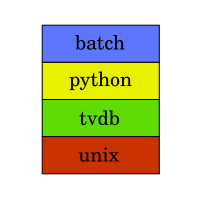

# Tok Tokkie Media Manager

|master|develop|
|:----:|:-----:|
|||

A collection of command-line media managing tools

## Further Information

* [Changelog](https://gitlab.namibsun.net/namboy94/toktokkie/raw/master/CHANGELOG)
* [License (GPLv3)](https://gitlab.namibsun.net/namboy94/toktokkie/raw/master/LICENSE)
* [Gitlab](https://gitlab.namibsun.net/namboy94/toktokkie)
* [Github](https://github.com/namboy94/toktokkie)
* [Python Package Index Site](https://pypi.python.org/pypi/toktokkie)
* [Documentation(HTML)](https://docs.namibsun.net/html_docs/toktokkie/index.html)
* [Documentation(PDF)](https://docs.namibsun.net/pdf_docs/toktokkie.pdf)
* [Git Statistics (gitstats)](https://gitstats.namibsun.net/gitstats/toktokkie/index.html)
* [Git Statistics (git_stats)](https://gitstats.namibsun.net/git_stats/toktokkie/index.html)
* [Test Coverage](https://coverage.namibsun.net/toktokkie/index.html)
