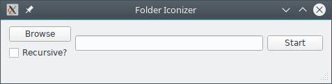
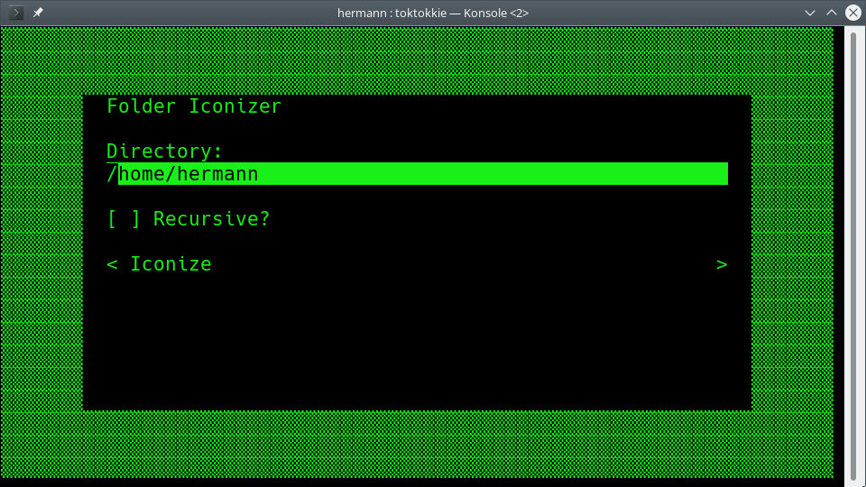

# Folder Iconizer

The Folder Iconizer module applies folder icons to media directories.

To do this, the ```.meta``` directory must have a subdirectory called
```icons``` filled with ```.png``` and/or ```.ico``` files (depending on your platform)
which are named according to the media directory's subdirectories.

An exception to this are the ```main.png``` and ```main.ico``` files, which are used for the
parent directory.

## Platforms

Due to the nature of folder icons, not all platforms are supported. Currently the
folder iconizer works on all Gnome-based Linux Desktop environments, as well
as Microsoft Windows. Mac OS and desktop environments like KDE are currently
not supported.

## Screenshots

**GUI**



**TUI**


