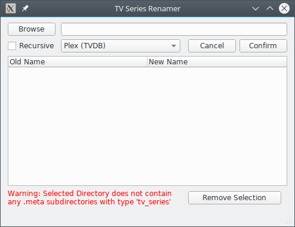

# TV Episode Renamer

The TV Episode Renamer allows automatic renaming of TV Series Episode files
in accordance to a naming scheme.

For a directory to work with the TV Episode Renamer, the directory's
```type``` must be *tv_series*.

Currently implemented naming schemes are as follows:

|Naming Scheme          |Format                           |
|-----------------------|---------------------------------|
|Plex, powered by TVDB  |Show Name - SXXEXX - Episode Name|

Normally, Episode names are fetched by using online services
like [TVDB](http://thetvdb.com/), but in case this fails, generic
episode names of the form *Episode X* is used.

The series name is determined by the media directory's name.

## Screenshots

**GUI**



**TUI**


