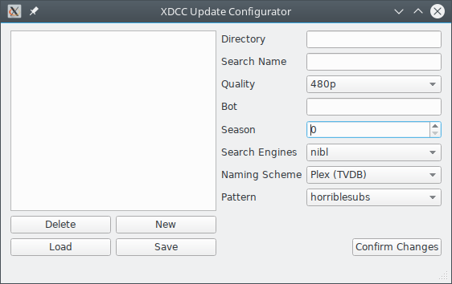
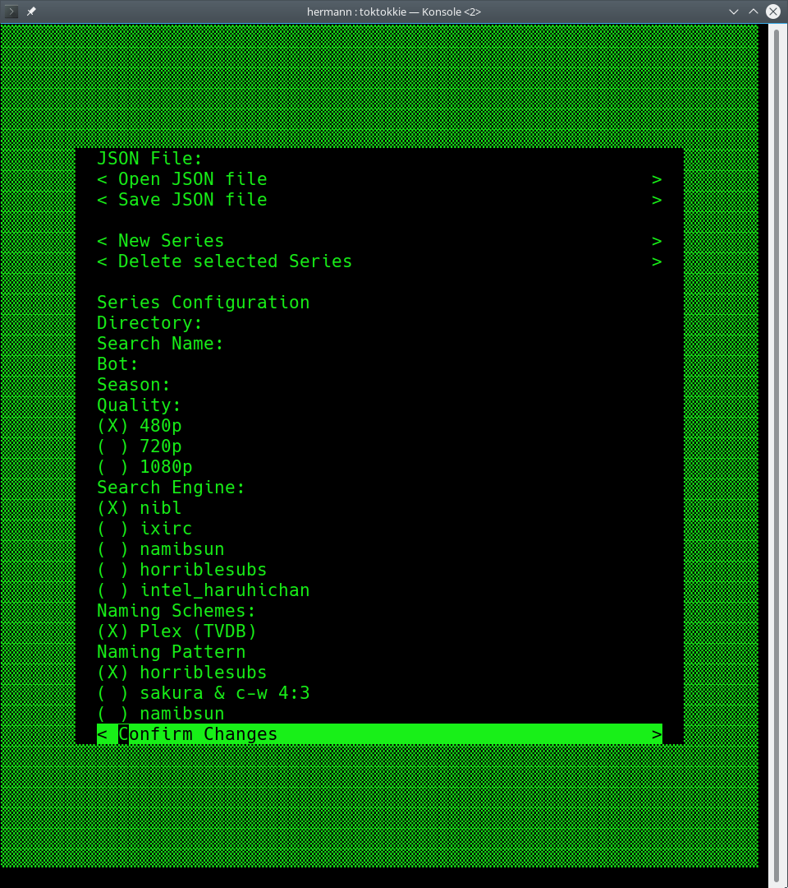

# XDCC Update

The XDCC Update Module can be used to set up an automated XDCC downloading script.
A potential use case for this is downloading tv series while they are airing.

To set up the script, one needs to create a JSON file using the XDCC Update Configurator
GUI or TUI that specifies which shows to download, at which quality and from which bot to download.

This JSON file can then be used by the ```xdcc-update``` script to start the downloads.

## Screenshots

**GUI**



**TUI**


