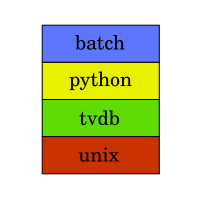

# Episode Renamer 

This is a collection of automated episode renamer programs. They have all been
replaced by the renaming functionality in
[toktokkie](https://gitlab.namibsun.net:/namboy94/toktokkie).

There are 4 separate projects included in this repository:

## [batch-episode-renamer](batch-episode-renamer)

A Java Program that requires manual input for every episode to rename

## [python-episode-renamer](python-episode-renamer)

A Python script which also requires manual input and is frankly really, really
ugly.

## [tvdb-episode-renamer](tvdb-episode-renamer)

A somewhat more advanced python program which uses tvdb to automatically fetch
episode names.

## [unix-episode-renamer](unix-episode-renamer)

Another python program that requires manual input. Provides a tkinter GUI.

## Further Information

* [Changelog](https://gitlab.namibsun.net/namboy94/episode-renamer/raw/master/CHANGELOG)
* [License (GPLv3)](https://gitlab.namibsun.net/namboy94/episode-renamer/raw/master/LICENSE)
* [Gitlab](https://gitlab.namibsun.net/namboy94/episode-renamer)
* [Github](https://github.com/namboy94/episode-renamer)
* [Git Statistics (gitstats)](https://gitstats.namibsun.net/gitstats/episode-renamer/index.html)
* [Git Statistics (git_stats)](https://gitstats.namibsun.net/git_stats/episode-renamer/index.html)
